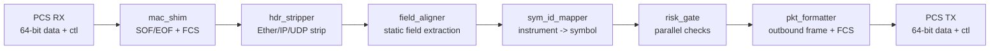
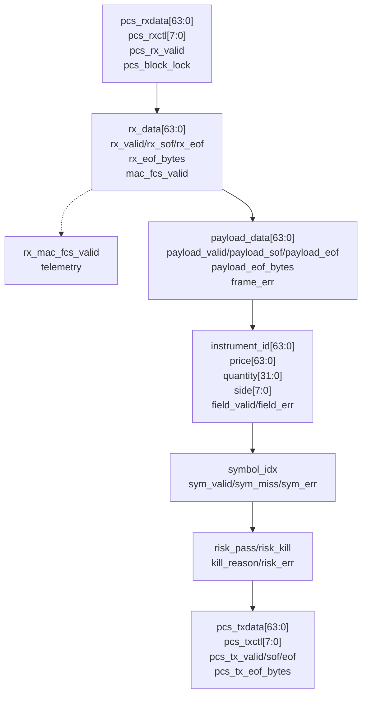
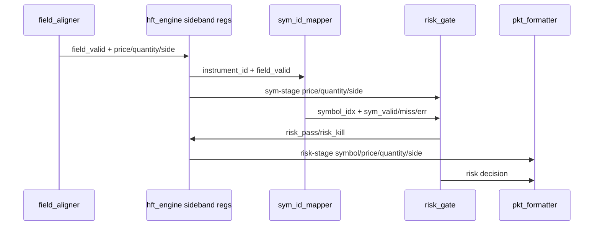

# RTL Microarchitecture

This directory contains the synthesizable SystemVerilog for the cut-through HFT
engine and the SVA bind files used to check each leaf block. The design is a
single-clock, fixed-order datapath from raw PCS RX words to raw PCS TX words.

## Top-Level Pipeline



The integrated top module is `hft_engine.sv`. It instantiates only the six
pipeline stages above and adds sideband alignment registers needed to keep
symbol, price, quantity, and side matched across the registered mapper and risk
stages.

## Clocking and Reset

| Item | Value |
| --- | --- |
| Clock | `clk_pcs` |
| Frequency target | 156.25 MHz |
| Cycle time | 6.4 ns |
| Reset | `rst_n`, active-low synchronous |
| Clock domains | One; no CDC logic in datapath |
| Datapath wrapper buses | None; no AXI/AHB/APB wrappers |

## Dataflow View



## Module Responsibilities

| Module | Primary Role | Registered Output Latency | Notes |
| --- | --- | ---: | --- |
| `mac_shim` | Detect Ethernet preamble/SFD, terminate, EOF byte count, and RX FCS validity. | 1 cycle | Leaves preamble/SFD in stream for `hdr_stripper`; CRC bit steps are unrolled. |
| `hdr_stripper` | Remove preamble plus fixed Ethernet/IPv4/UDP headers and align UDP payload. | Causal stream latency | Emits payload when enough header bytes have arrived; see spec gap below. |
| `field_aligner` | Extract typed fields from static UDP payload offsets and byte-swap once. | 1-3 payload words | Current fields reach byte 23, so default layout completes on payload word 3. |
| `sym_id_mapper` | Map 64-bit instrument ID to compact symbol index. | 1 cycle | Direct-mapped tag table loaded through off-path config pins. |
| `risk_gate` | Evaluate price, quantity, global kill, symbol miss, and upstream error checks in parallel. | 1 cycle | Risk limits are loaded through off-path config pins; decision outputs remain mutually exclusive. |
| `pkt_formatter` | Format approved tuple into outbound Ethernet/IPv4/UDP order frame. | 1 cycle to SOF | Emits eight 64-bit TX words for the current minimum-size frame template. |
| `hft_engine` | Integrate pipeline and align sideband fields between stages. | N/A | Raw PCS RX/TX boundary plus RX FCS telemetry. |

`rx_mac_fcs_valid` is intentionally telemetry only. It is asserted when
`mac_shim` observes a good inbound FCS at EOF, but it does not gate
`hdr_stripper`, `risk_gate`, or `pkt_formatter`. Gating on FCS would require
waiting until EOF and would change the cut-through latency model.

## Integration Microarchitecture



`hft_engine` captures field sidebands when `field_valid` asserts. On the mapper
valid cycle, it captures the mapped symbol and forwards the matching price,
quantity, and side to the formatter stage. This prevents a pass/kill decision
from being paired with stale or future order fields.

## Nominal Latency

The latest integrated smoke measurement at 156.25 MHz is:

| Segment | Cycles | Time |
| --- | ---: | ---: |
| `mac_sof` to `payload_sof` | 7 | 44.8 ns |
| `payload_sof` to `field_valid` | 3 | 19.2 ns |
| `field_valid` to `sym_valid` | 1 | 6.4 ns |
| `sym_valid` to risk decision | 1 | 6.4 ns |
| Risk decision to `tx_sof` | 1 | 6.4 ns |
| `mac_sof` to `tx_sof` | 13 | 83.2 ns |
| `tx_sof` to `tx_eof` | 7 | 44.8 ns |

The decision path after all fields are available is three cycles:

```text
field_valid -> sym_valid -> risk_pass/risk_kill -> pcs_tx_sof
```

The larger `mac_sof` to `tx_sof` number is dominated by the causal need to
receive the fixed headers and payload bytes before the required fields exist.

## Packet and Field Assumptions

Inbound payload extraction currently assumes the default field layout below, with
compile-time parameters available for alternate static offsets inside the first
24 payload bytes.

| Field | Default UDP Payload Bytes | Width | Internal Endian |
| --- | ---: | ---: | --- |
| `msg_type` | 0-1 | 16 | byte-reversed from wire |
| `instrument_id` | 2-9 | 64 | byte-reversed from wire |
| `price` | 10-17 | 64 | byte-reversed from wire |
| `quantity` | 18-21 | 32 | byte-reversed from wire |
| `side` | 22 | 8 | unchanged |

Outbound formatting currently emits a fixed Ethernet/IPv4/UDP template with a
compact 16-byte order payload plus two pad bytes and Ethernet FCS. Destination
addressing, source addressing, and the production exchange order schema are still
spec gaps.

## Risk Checks

`risk_gate` evaluates all implemented checks in parallel and registers the
decision one cycle after `sym_valid`. Limit entries are loaded out of band before
live traffic; config writes are not part of the packet timing path.

| Check | Current Condition | `kill_reason` |
| --- | --- | ---: |
| Price floor | `price < risk_price_floor[symbol_idx]` | `4'h1` |
| Price ceiling | `price > risk_price_ceil[symbol_idx]` | `4'h2` |
| Quantity limit | `quantity > risk_qty_max[symbol_idx]` | `4'h3` |
| Global kill | synchronously captured `risk_global_kill` | `4'h4` |
| Symbol miss | `sym_miss` | `4'h5` |
| Upstream error | `sym_err` | `4'hF` |
| Multiple simultaneous causes | any two or more causes | `4'hE` |

`sym_id_mapper` similarly reads a direct-mapped tag table indexed by the lower
instrument bits. A disabled entry or tag mismatch asserts `sym_miss`.

## Assertion Bind Coverage

| Bind File | Coverage Theme |
| --- | --- |
| `mac_shim_assertions.sv` | SOF/EOF validity, block-lock clearing including mid-frame loss, preamble forwarding, registered data alignment. |
| `hdr_stripper_assertions.sv` | Payload SOF/EOF validity, bounded SOF-to-EOF completion, no-gap streaming, error suppression behavior. |
| `field_aligner_assertions.sv` | Field valid/error relationship, default extraction correctness, propagated errors. |
| `sym_id_mapper_assertions.sv` | One-cycle valid timing, config-backed index/tag behavior, tag miss, field error propagation. |
| `risk_gate_assertions.sv` | Pass/kill exclusivity, config-backed one-cycle decisions, global kill, kill reason encoding. |
| `pkt_formatter_assertions.sv` | One-cycle launch, exactly one SOF per TX frame, no TX gaps, kill suppression, EOF shape, raw TX control behavior. |

## Current `SPEC_GAP` Items in RTL

| Module | Gap |
| --- | --- |
| `hdr_stripper` | Bad-length definition is not numerically specified. |
| `hdr_stripper` | Two-cycle SOF-to-payload budget conflicts with in-stream preamble/header stripping. |
| `sym_id_mapper` | Reset-time serial table load is required by spec; current branch uses direct off-path load pins while the serial protocol remains undefined. |
| `risk_gate` | Reset-time serial risk table load is required by spec; current branch uses direct off-path limit load pins plus global kill while the serial protocol remains undefined. |
| `risk_gate` | Simultaneous violation priority is unspecified; implementation reports multi-cause kills as `4'hE`. |
| `pkt_formatter` | Production addressing and order payload schema are unspecified. |
| `hft_engine` | Top-level raw PCS boundary conflicts with spec text listing derived MAC top-level signals; FCS status is exposed as telemetry while other derived MAC signals remain internal. |

## Local Lint Commands

From the repository root:

```bash
make lint
```

Or directly:

```bash
scripts/run_verilator_flow.sh lint
```

To lint a single block with assertions:

```bash
verilator --lint-only --timing --assert --top-module risk_gate \
    rtl/risk_gate.sv rtl/risk_gate_assertions.sv
```
