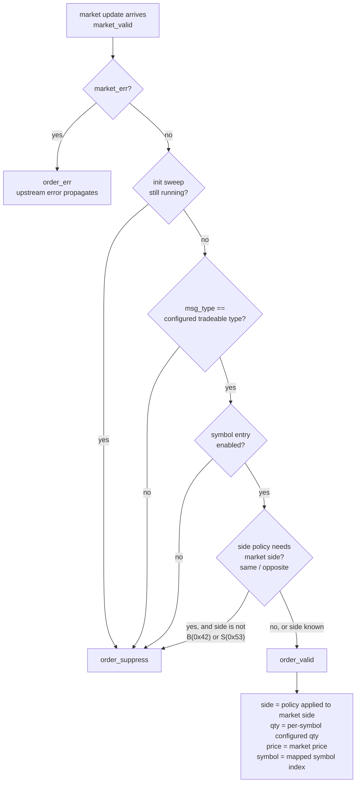
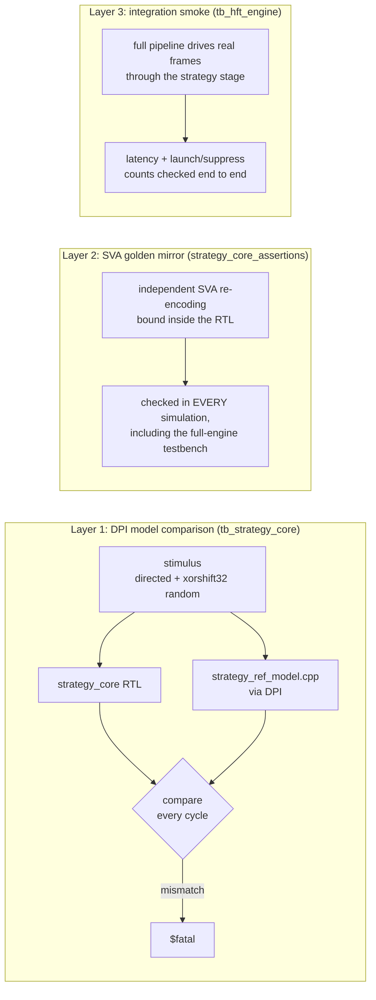

# Golden Model Verification

This directory holds the **golden reference models**: software implementations
of decision logic that serve as the executable specification for the RTL. This
document explains what the strategy golden model is, how the verification
around it works, how to run it, and how to see it in waveforms.

## What the golden model is

`strategy_ref_model.cpp` is a bit-accurate C++ implementation of the
`strategy_core` decision function. It is deliberately **not** a copy of the
RTL: it is a second, independent encoding of the same intent, written in a
different language with different failure modes. The RTL and the model are
only ever trusted *together* — when both agree on every cycle of every test,
a bug would have to exist identically in two independent implementations to
slip through.

Rules of the road:

1. The model is the specification. Any intended change to decision behavior
   is made in `strategy_ref_model.cpp` first, then in `rtl/strategy_core.sv`.
2. `tb_strategy_core` must stay green against both. A mismatch is a `$fatal`,
   never a warning.
3. The model stays free of RTL-isms (no clocks, no resets, no X). It answers
   one question: *given these inputs and this configuration, what is the one
   correct decision?*

## The decision function

This is the entire Stage-1 strategy, as encoded in both the C++ model and the
RTL:



Exactly one of `order_valid` / `order_suppress` / `order_err` fires for every
`market_valid`, one cycle later. That one-hot determinism contract is itself
asserted in hardware (see layer 2 below).

Side policy encoding (per-symbol table entry):

| `side_policy` | Meaning | Order side |
| --- | --- | --- |
| `2'b00` | same | market side (requires known side) |
| `2'b01` | opposite | B→S, S→B (requires known side) |
| `2'b10` | fixed buy | always `0x42` |
| `2'b11` | fixed sell | always `0x53` |

## The three verification layers



- **Layer 1** is this directory's model: the testbench drives *identical
  stimulus* into the RTL and (through DPI) into the C++ function, and compares
  the decision **and** every order field on every checked cycle. The stream is
  directed cases (all four policies, every suppress cause, upstream error,
  init-sweep behavior) followed by a deterministic pseudo-random stream driven
  back-to-back with no idle gaps — 315 checked cycles per run.
- **Layer 2** is a *third* independent encoding: the assertion bind file
  mirrors the configuration state in SVA and checks the same contract
  continuously, in every simulation that instantiates `strategy_core` —
  including the full-engine smoke test, where the DPI model is not present.
- **Layer 3** proves the stage works in context: real Ethernet frames in,
  order frames out, latency measured, suppression counted.

The comparison is honest because the testbench mirrors the *configuration it
drove* (not the DUT's internal tables) into the model's arguments. The model
never sees inside the RTL; both sides derive their answer from the same
externally-known facts.

## How to run it

```bash
make test          # full suite; tb_strategy_core is one of the 8 testbenches
```

The strategy testbench prints its evidence on success:

```text
strategy_core reference-model comparison: 315 cycles checked
```

Any disagreement stops the simulation immediately with the offending case
named, e.g. `random iter 137: field mismatch side=42/53 ...`. CI runs the same
suite on every push and pull request.

To iterate on just this pair (model + RTL), run the single testbench:

```bash
scripts/run_verilator_flow.sh test   # or make test; the flow builds each TB separately
```

## Seeing it in the waves

```bash
make test                          # produces tb/strategy_core_smoke.vcd
make waves MOD=strategy_core       # opens it in gtkwave (run from WSL)
```

The C++ model has no wires of its own — it executes inside the simulator
process — so the testbench **latches the model's verdict into dumped signals**
every time it checks a cycle. In gtkwave, add these two groups side by side:

| Group | Signals | Meaning |
| --- | --- | --- |
| DUT (actual) | `dut.order_valid`, `dut.order_suppress`, `dut.order_err`, `dut.order_side`, `dut.order_quantity` | what the RTL decided |
| Model (expected) | `model_decision`, `model_side`, `model_qty`, `model_checked` | what the golden model says it should have decided |

`model_decision` encoding: `0` idle, `1` valid, `2` suppress, `3` err.

Visual verification is then a single rule: **on every cycle where
`model_checked` is high, the DUT trace and the model trace must tell the same
story** — `model_decision == 1` exactly where `order_valid` pulses (with
`model_side`/`model_qty` matching `order_side`/`order_quantity`),
`2` where `order_suppress` pulses, `3` where `order_err` pulses:

```text
clk            _/‾\_/‾\_/‾\_/‾\_/‾\_/‾\_
market_valid   ____/‾‾‾‾‾‾‾‾‾‾‾‾‾‾‾\____
msg_type       ----X 1234 X 4321 X 1234 X---   (1234 = configured tradeable)
                        |       |       |
order_valid    ________/‾‾‾\___________/‾‾‾\_  <- RTL, one cycle later
order_suppress ____________/‾‾‾\____________
model_decision ---0----X 1 X 2 X 1 X----      <- golden model, same cycles
model_side     --------X 53 X   X 53 X----     (opposite of market B=42)
```

Because a mismatch is fatal, any VCD from a *passing* run is already a proof
trace: the two groups agree everywhere by construction. The waveform view is
most useful when a run fails — the VCD is written up to the failing cycle, and
the disagreement is visible at the exact timestamp of the `$fatal`, with the
model's expectation sitting directly under the RTL's wrong answer.

The same visual check works in the full-engine waves (`make waves` with the
default `hft_engine` dump): the DPI model is not present there, but layer 2's
SVA mirror is compiled in and will have stopped the simulation on any
violation, so an intact `tb/hft_engine_smoke.vcd` means the strategy stage
obeyed its contract for every frame — inspect
`dut.u_strategy_core.order_*` against `dut.sym_valid` to watch the
decision pipeline in context.

## Extending this pattern (stages 2-4)

Each future strategy capability follows the same recipe:

1. Extend `strategy_ref_model.cpp` (or add a sibling model) with the new
   behavior — this is the design review artifact.
2. Extend the RTL to match.
3. Extend the testbench stimulus so the random stream reaches the new
   behavior, and mirror any new configuration into the model call.
4. Extend the SVA mirror for the always-on contract.

State (market data tables, positions) moves the models from pure functions to
objects with the same update rules as the RTL — the comparison discipline
stays identical: same stimulus in, same answer out, every cycle, or `$fatal`.
